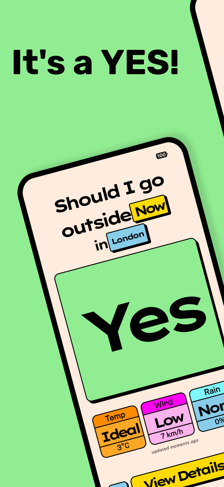
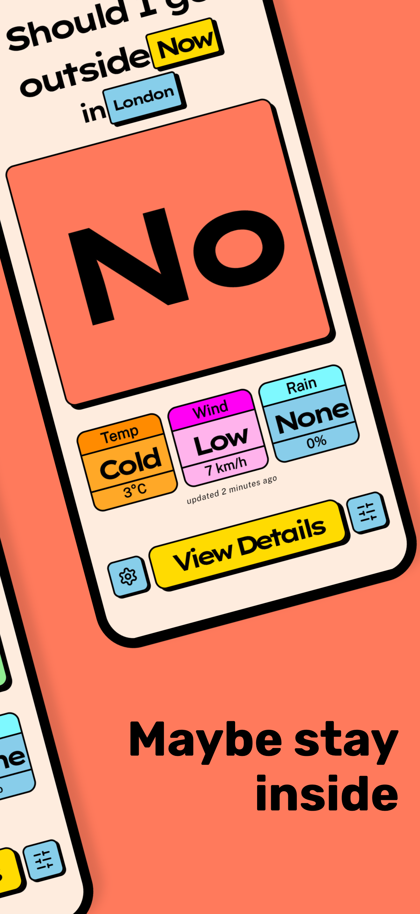
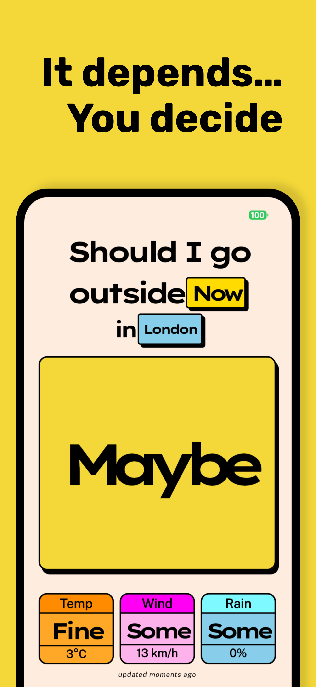
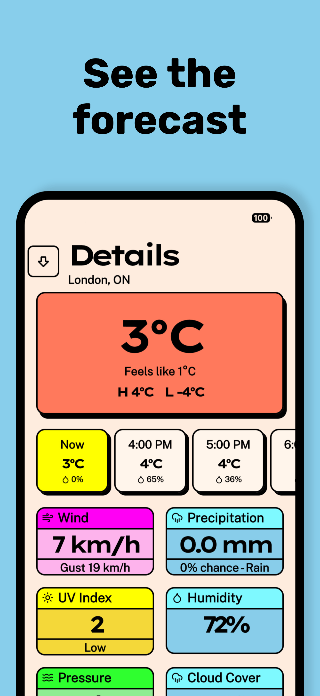
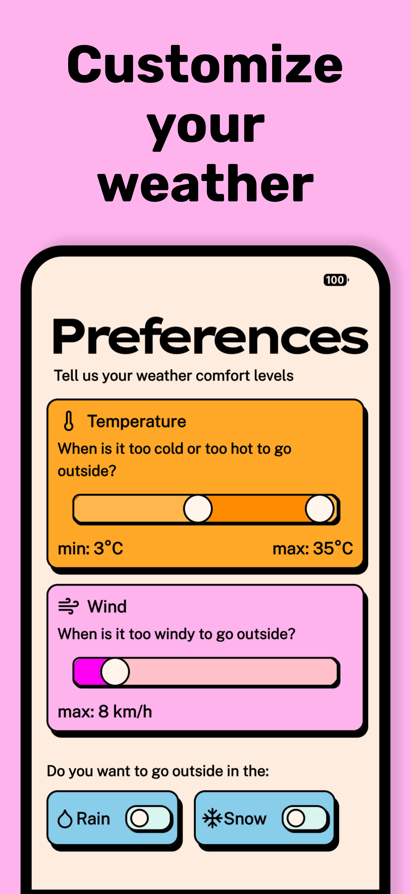

<p align="center">
  
</p>

<h1 align="center">Should I go outside?</h1>

<p align="center">
  A dead simple weather app that answers one question — <em>should I go outside?</em><br />
  Built with Kotlin Multiplatform for Android &amp; iOS.
</p>

<p align="center">
  <a href="https://play.google.com/store/apps/details?id=dev.jordon.sigo">
    
  </a>
  &nbsp;
  <a href="https://apps.apple.com/app/should-i-go-outside/id123456789">
    
  </a>
</p>

<p align="center">
  
  &nbsp;
  
  &nbsp;
  
  &nbsp;
  
  &nbsp;
  
</p>

## About

**Should I go outside?** (or **SIGO**) is a weather app that cuts through the noise. Open it up and it fetches the forecast for your current location, then gives you a straightforward **Yes**, **No**, or **Maybe** — based on your personal weather preferences.

Set your ideal temperature range, wind tolerance, and whether you're okay with rain or snow. SIGO does the rest. And if you want the full picture, the detailed forecast is just a tap away.

Built with Kotlin Multiplatform, powered by the [Visual Crossing API](https://www.visualcrossing.com/).

## What if I want to roll my own?

Since this repository is open source, that means you can roll your own version of the backend and
build the app yourself. That way you have total control over your data.

There are two ways of manually setting up the app:

- Hosted backend API
    - Currently only Cloudflare Workers are supported
- Direct access to the Weather API via the app
    - This requires you to add your API Token to the `./app-env.properties` file
    - This will add the API token to a Build Config value, which the app will see and enable direct
      communication to the weather API

## Setup

Go to [VisualCrossing](https://www.visualcrossing.com/) and grab your API key.

Clone the repository:

```shell
git clone git@github.com:jordond/sigo
cd sigo
```

Now run the init script:

```shell
# Initialize the app properties and secrets
# You will be prompted for an API key for the Forecast aPI
./sigo init

# Optional, for development of sigo
./sigo init ktlint
./sigo init hooks
```

The `init` script will prompt you for your API token and store it in the `app-env.properties` file.
You are now ready to build the app, and deploy to Cloudflare.

If you are using a custom deploy to Cloudflare make sure you set the `APP_BACKEND_URL` property in
`app-env.properties`.

## Building front-end app

First decide if you plan on using a [Custom Backend](#custom-backend-api) or will be hitting
the [VisualCrossing API](https://www.visualcrossing.com/) directly.

Now you will need to edit `app-env.properties` with the required values:

### Custom Backend

```properties
# app-env.properties
APP_BACKEND_URL=https://api.my-domain.net
APP_USE_DIRECT_API=false
FORECAST_API_KEY=<My VisualCrossing API key>
```

### Direct to Visual Crossing

```properties
# app-env.properties
APP_USE_DIRECT_API=true
FORECAST_API_KEY=<My VisualCrossing API key>
```

**Note:** Optionally you can set `APP_ENABLE_INTERNAL_SETTINGS` to `true` to enable the internal
settings so you can change these values at runtime in the app.

Now you're ready to build the client app:

- [Android](./docs/build/android)
- [iOS](./docs/build/ios)
- More planned soon

If you are using the Direct API, then you are done!

However if you are deploying a custom backend, follow the steps [below](#custom-backend-api).

## Custom Backend API

The API handles all communication to the Weather API, there are three planned implementations:

- [x] [Cloudflare Worker](./docs/api/cloudflare.md)
- [ ] Firebase Function
- [ ] Standalone Ktor server