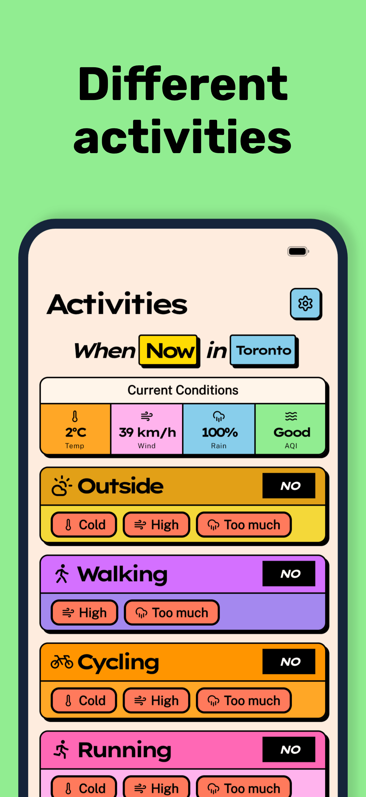

<p align="center">
  
</p>

<h1 align="center">Should I go outside?</h1>

<p align="center">
  A dead simple weather app that answers one question: <em>should I go outside?</em><br />
  Built with Kotlin Multiplatform for Android &amp; iOS.
</p>

<p align="center">
  <a href="https://play.google.com/store/apps/details?id=now.shouldigooutside">
    
  </a>
  <a href="https://apps.apple.com/us/app/should-i-go-outside-weather/id6760564555">
    
  </a>
</p>

<p align="center">
  <a href="https://www.producthunt.com/products/should-i-go-outside?embed=true&amp;utm_source=badge-featured&amp;utm_medium=badge&amp;utm_campaign=badge-should-i-go-outside" target="_blank" rel="noopener noreferrer"></a>
</p>

<p align="center">
  
  
  
  
  
  
</p>

## About

**Should I go outside?** (or **SIGO**) is a weather app that fetches the forecast for your current
location and gives you a **Yes**, **No**, or **Maybe** based on your weather preferences.

You configure your ideal temperature range, wind tolerance, and whether you mind rain or snow. The
app checks the current conditions against those preferences and gives you an answer. A detailed
forecast view is also available.

Built with Kotlin Multiplatform. Forecasts from
the [Visual Crossing API](https://www.visualcrossing.com/).

## Motivation

This is a fun side project to explore Compose Multiplatform and Kotlin Multiplatform in general. It
targets Android, iOS, Desktop, and even has a CLI and backend API. I hope others can learn from it,
whether you're just getting started with KMP or looking for a real-world example of how to structure
a multiplatform project.

For a deeper look at how the project is organized, check out the
[Architecture documentation](./docs/architecture.md).

## What if I want to roll my own?

The repo is open source, so you can host your own backend and build the app yourself.

There are two ways to set up the app:

- Hosted backend API
    - Cloudflare Workers or a standalone JVM server (Docker)
- Direct access to the Weather API via the app
    - This requires you to add your API Token to the `./app-env.properties` file
    - The token is embedded via BuildConfig, and the app will call the weather API directly

## Setup

Get an API key from [Visual Crossing](https://www.visualcrossing.com/), then clone the repo:

```shell
git clone git@github.com:jordond/sigo
cd sigo
```

Run the init script:

```shell
# Prompts for your Visual Crossing API key
./sigo init

# Optional, for development
./sigo init ktlint
./sigo init hooks
```

This stores your API key in `app-env.properties`. If you're deploying a custom backend to
Cloudflare, also set `APP_BACKEND_URL` in that file.

## Building front-end app

Decide whether you're using a [Custom Backend](#custom-backend-api) or calling
the [Visual Crossing API](https://www.visualcrossing.com/) directly, then edit `app-env.properties`:

### Custom Backend

```properties
# app-env.properties
APP_BACKEND_URL=https://api.my-domain.net
USE_DIRECT_API=false
FORECAST_API_KEY=<your Visual Crossing API key>
```

### Direct to Visual Crossing

```properties
# app-env.properties
USE_DIRECT_API=true
FORECAST_API_KEY=<your Visual Crossing API key>
```

**Note:** Set `ENABLE_INTERNAL_SETTINGS=true` to change these values at runtime in the app.

Build the client app:

- [Android](./docs/build/android)
- [iOS](./docs/build/ios)

If you're using the Direct API, you're done. For a custom backend, see below.

## Custom Backend API

The backend proxies requests to the weather API. Implementations:

- [x] [Cloudflare Worker](./docs/api/cloudflare.md)
- [x] [JVM Server (Docker)](./docs/api/server.md)
- [ ] Firebase Function

---

### AI Disclaimer

[Claude Code](https://docs.anthropic.com/en/docs/claude-code) was used to assist with development,
but the majority of the planning, architecture, and code was written by me.
