# Architecture

## Overview

SIGO is a Kotlin Multiplatform weather app. It fetches the forecast for a user's location and
returns a Yes, No, or Maybe based on configured weather preferences.

The app runs on Android and iOS via Compose Multiplatform. A Desktop (JVM) build and a CLI tool also
exist. The backend API has two deployable targets: a JVM server (Ktor + Netty) and a Cloudflare
Worker (Kotlin/JS).

## Module Groups

The project is organized into four groups:

- **core/** - Shared libraries used across the project. Data models, business logic, platform
  abstractions, UI components, API routing, and the app shell.
- **feature/** - Feature-specific logic and screens. Each feature module owns its domain logic,
  state management, and (optionally) its Compose UI.
- **apps/** - Runnable application targets. Android, iOS, Desktop, CLI, JVM API server, and
  Cloudflare Worker.
- **buildLogic/** - Gradle convention plugins and toolchain utilities. Not published; used only
  during the build.

## Dependency Graph

```mermaid
graph TD
    subgraph core
        model
        domain --> model
        platform --> model
        foundation --> model
        foundation --> platform
        config --> foundation
        config --> model
        config --> platform
        resources
        ui-icons
        ui --> domain
        ui --> model
        ui --> platform
        ui --> resources
        ui --> ui-icons
        api-server["api/server"] --> domain
        api-server --> foundation
        api-server --> model
        api-server --> platform
        api-client["api/client"] --> api-server
        api-client --> domain
        api-client --> foundation
        api-client --> model
        api-client --> platform
        app --> api-client
        app --> config
        app --> domain
        app --> foundation
        app --> model
        app --> platform
        app --> resources
        app --> ui
    end

    subgraph feature
        forecast --> config
        forecast --> model
        forecast --> domain
        forecast --> foundation
        forecast --> platform
        forecast-ui["forecast/ui"] --> model
        forecast-ui --> domain
        forecast-ui --> foundation
        forecast-ui --> platform
        forecast-ui --> resources
        forecast-ui --> ui
        forecast-ui --> ui-icons
        location --> config
        location --> domain
        location --> foundation
        location --> model
        location --> platform
        location --> resources
        location --> ui
        location --> ui-icons
        settings --> config
        settings --> domain
        settings --> foundation
        settings --> model
        settings --> platform
        settings --> resources
        settings --> ui
        settings --> ui-icons
        onboarding --> model
        onboarding --> domain
        onboarding --> foundation
        onboarding --> platform
        onboarding --> resources
        onboarding --> ui
        onboarding --> ui-icons
        webview --> foundation
        webview --> platform
        webview --> model
        webview --> resources
        webview --> ui
    end

    api-server --> forecast
    api-client --> forecast
    app --> forecast
    app --> forecast-ui
    app --> location
    app --> onboarding
    app --> settings
    app --> webview

    subgraph apps
        android --> app
        ios --> app
        desktop --> app
        desktop --> resources
        cli --> domain
        cli --> foundation
        cli --> model
        cli --> platform
        cli --> forecast
        cli --> settings
        api-jvm["api/server (JVM)"] --> api-server
        api-jvm --> domain
        api-jvm --> foundation
        api-jvm --> model
        api-jvm --> platform
        api-jvm --> forecast
        api-worker["api/worker (JS)"] --> api-server
        api-worker --> domain
        api-worker --> foundation
        api-worker --> model
        api-worker --> platform
        api-worker --> forecast
    end
```

Notable cross-layer dependencies:

- `core/api/server` depends on `feature/forecast`. This is because the server-side router calls
  forecast logic directly rather than going through an intermediary.
- `core/api/client` also depends on `feature/forecast` for the same reason.
- `core/app` depends on all feature modules since it wires up navigation and dependency injection
  for the full app.

## Core Layer

**core/model** - Data classes and serialization. This is the leaf module with no project
dependencies. All other modules depend on it. Also holds BuildKonfig-generated config values (API
keys, backend URL, feature flags) injected at compile time from `app-env.properties`.

**core/domain** - Business logic interfaces and use cases. Defines `ApiTokenProvider`,
`ForecastRepository`, geolocation interfaces, and the `StateHolder` pattern used for state
management across the app.

**core/platform** - Platform-specific implementations behind common interfaces. HTTP client
engines (OkHttp on Android/JVM, Darwin on iOS, JS fetch), file storage, connectivity checks, and
Koin module declarations. Uses custom `deviceMain` and `nonDeviceMain` source sets to separate
mobile/desktop behavior from server/CLI behavior.

**core/foundation** - Shared utilities and helpers that depend on both `core/model` and
`core/platform`. Koin module wiring, coroutine utilities, and common extension functions.

**core/config** - Application configuration. Wraps Firebase Remote Config for feature flags and uses
KStore for local persistence of config values.

**core/resources** - Compose Multiplatform resources: images, strings, and color definitions. No
project dependencies.

**core/ui** - Shared Compose components and the app theme. Exposes `core/ui-icons` via an `api`
dependency so consumers get icons transitively. Contains preference UI components, navigation
helpers, window size class handling, and the color/shape/typography definitions.

**core/ui-icons** - Re-exports Material Icons Extended for Compose. Isolated into its own module to
keep compile times down.

**core/app** - The composition root. Wires together all core and feature modules via Koin dependency
injection. Owns the Room database setup, navigation graph, and lifecycle management. Android, iOS,
and Desktop app modules depend on this single module.

## API Layer

The API layer is split into shared logic and deployable targets.

**core/api/server** is a multiplatform module that defines the API router, request/response types,
CORS handling, and rate limiting. On JVM targets it uses Ktor's server APIs. On JS targets it uses a
custom adapter that bridges to Cloudflare Worker request/response types. The single endpoint is
`GET /forecast?lat=<lat>&lon=<lon>`. All requests require an `X-Client-ID` header containing a
valid UUID, used for per-client rate limiting.

**core/api/client** is a multiplatform HTTP client that calls the forecast API. It uses OkHttp on
Android/JVM, the Darwin URL session on iOS, and JS fetch on browser/worker targets.

The two deployable API targets:

- **apps/api/server** - A JVM application using Ktor with Netty. Configured via environment
  variables (`FORECAST_API_KEY`, `PORT`, `LOG_LEVEL`). Includes a Docker multi-stage build for
  deployment. See [docs/api/server.md](api/server.md) for operational details.
- **apps/api/worker** - A Cloudflare Worker compiled from Kotlin/JS. Deployed via Wrangler. API key
  is stored as a Cloudflare secret. See [docs/api/cloudflare.md](api/cloudflare.md) for deployment
  instructions.

## Feature Layer

**feature/forecast** - Forecast domain logic and state management. Defines repositories, data
transformations, and `StateHolder`-based view state. This is a non-UI module that targets all
platforms.

**feature/forecast/ui** - Compose screens for the forecast feature: home screen, detailed forecast
view, and location search sheet.

**feature/location** - Location search and geolocation. Uses the Compass library for geocoding,
reverse geocoding, and autocomplete. Handles runtime location permissions on mobile platforms.

**feature/settings** - Settings screen and app version display. Persists user preferences via
KStore. Uses the `AppVersion` toolchain plugin to inject the version string at compile time.

**feature/onboarding** - First-launch onboarding flow.

**feature/webview** - In-app webview for displaying external content (e.g., privacy policy, terms).

## App Layer

**apps/android** - Android entry point. Depends only on `core/app`. Configures Firebase (Analytics,
Remote Config, Crashlytics), signing, ProGuard, and core library desugaring.

**apps/ios** - iOS entry point. Exports a Kotlin Native framework consumed by the Swift/SwiftUI
shell. Depends on `core/app`.

**apps/desktop** - Compose for Desktop application. JVM target. Depends on `core/app` and
`core/resources`.

**apps/cli** - A terminal application built with Clikt and Mordant. Fetches the forecast and prints
a formatted result. Does not depend on `core/app` since it has no UI; instead it depends on
`core/domain`, `core/platform`, `feature/forecast`, and `feature/settings` directly.

**apps/api/server** - See [API Layer](#api-layer).

**apps/api/worker** - See [API Layer](#api-layer).

## Build System

**buildLogic/toolchain** - Defines the `AppVersion` Gradle task. Reads a version string from the
Gradle version catalog and generates a Kotlin file with the version constant. Used by
`apps/api/server`, `apps/api/worker`, and `feature/settings`.

**buildLogic/convention** - Defines the `configureMultiplatform()` function and `Platforms` enum.
Modules apply the `convention.multiplatform` plugin and call
`configureMultiplatform(Platforms.All)` (or a subset) to get standardized KMP target configuration
without repeating boilerplate.

**Gradle version catalog** - All dependency versions and plugin declarations live in
`gradle/libs.versions.toml`.

## Configuration

Compile-time configuration is managed through `app-env.properties` at the project root:

| Property                   | Purpose                                                                                |
|----------------------------|----------------------------------------------------------------------------------------|
| `FORECAST_API_KEY`         | Visual Crossing API key                                                                |
| `APP_BACKEND_URL`          | Backend API URL (for proxy mode)                                                       |
| `USE_DIRECT_API`           | If `true`, the app calls the weather API directly instead of going through the backend |
| `ENABLE_INTERNAL_SETTINGS` | If `true`, exposes a settings screen that lets you change API config at runtime        |

These values are injected into `core/model` via the BuildKonfig plugin and become compile-time
constants.

For server deployments, configuration is read from environment variables at runtime.
See [docs/api/server.md](api/server.md) and [docs/api/cloudflare.md](api/cloudflare.md).

For project setup, see the [root README](../README.MD). For the `./sigo` CLI wrapper,
see [docs/scripts.md](scripts.md).
